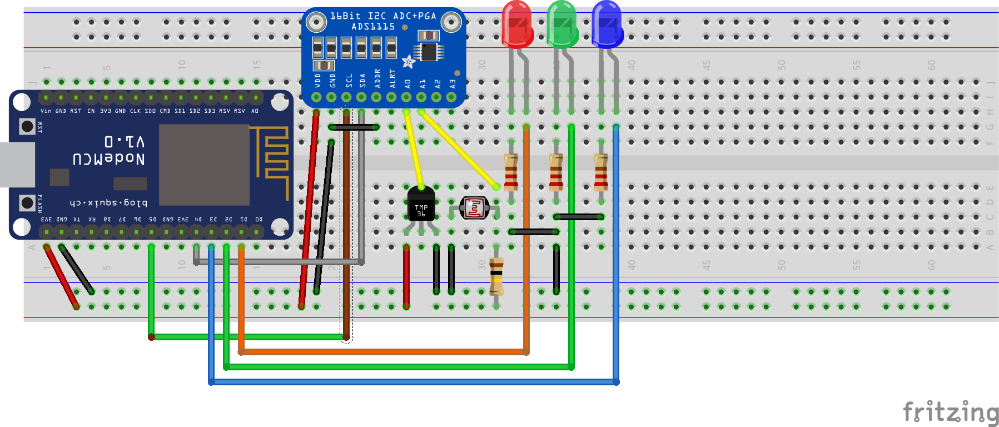

# Example

## Hardware needed

* NodeMcu - ESP8266 Development board
* Adafruit ADS1115 - I2C Analog digital convert
* TMP36 - Temperature sensor
* Photodiode
* 3 leds, different color
* Resistors
* Wires
* Breadboard

## Setup

## Use

1. Upload the ./data folder
2. Compile & upload the sketch (.ino files)
3. Serial will output an IP-address
4. Open the IP-address in a browser

